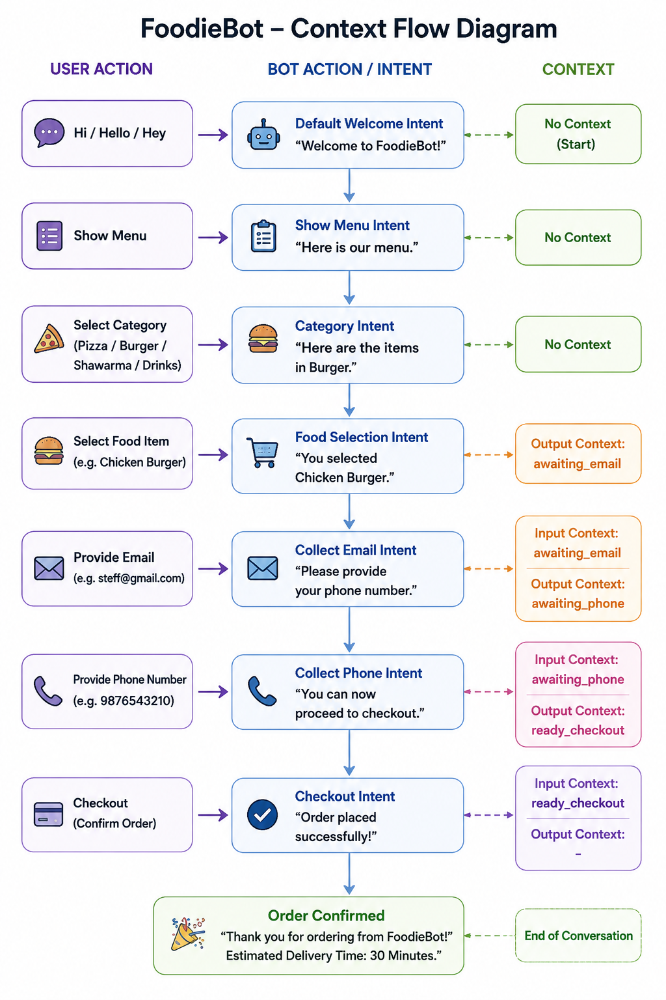
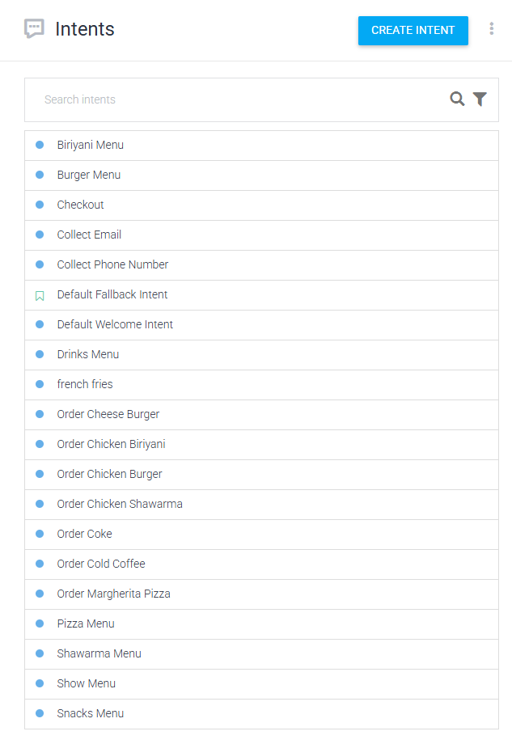

# FoodieBot 🍔🍕

FoodieBot is a food ordering chatbot developed using Dialogflow ES.

The chatbot allows users to browse menu categories, select food items, provide contact information, and complete the checkout process through a conversational interface.

## Features

* Welcome and greeting responses
* Menu navigation
* Category-based food selection
* Food ordering workflow
* Email collection
* Phone number collection
* Checkout process
* Context-based conversation management using Dialogflow Contexts

## Technologies Used

* Dialogflow ES
* Google Cloud
* Intents
* Contexts
* Training Phrases

## Context Flow

## Intent Structure

## Demo Video

🎥 Watch the chatbot demo here:

https://drive.google.com/file/d/1v166JTxeGNbEfQ6FMWpRGdJnvzMYrLhW/view?usp=sharing

## Conversation Flow

User → Greeting

↓

Show Menu

↓

Select Category

↓

Select Food Item

↓

Provide Email

↓

Provide Phone Number

↓

Checkout

↓

Order Confirmation

## Project Files

* FoodieBot.zip (Dialogflow Agent Export)
* Screenshots
* Demo Video

## Author

Steffeno Selva

https://drive.google.com/file/d/1v166JTxeGNbEfQ6FMWpRGdJnvzMYrLhW/view?usp=sharing
